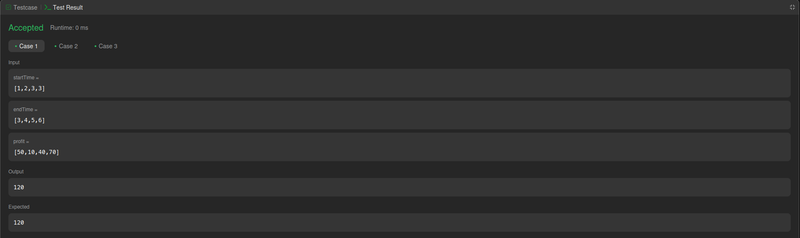
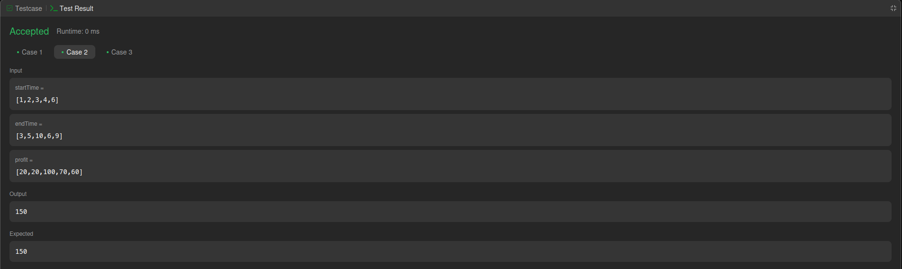
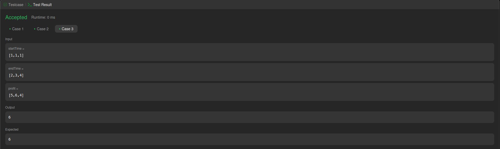
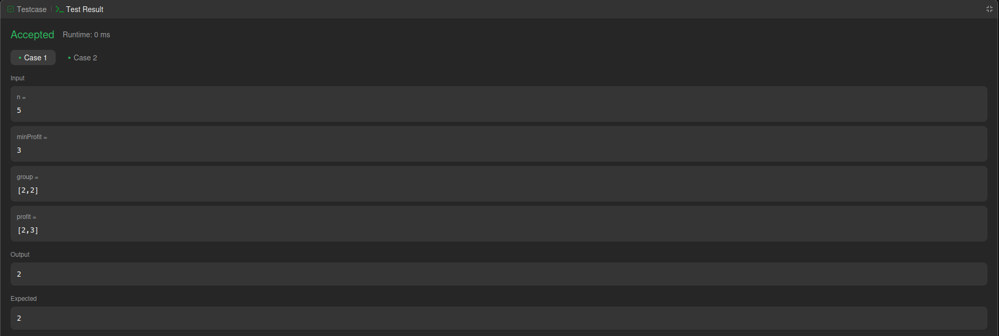
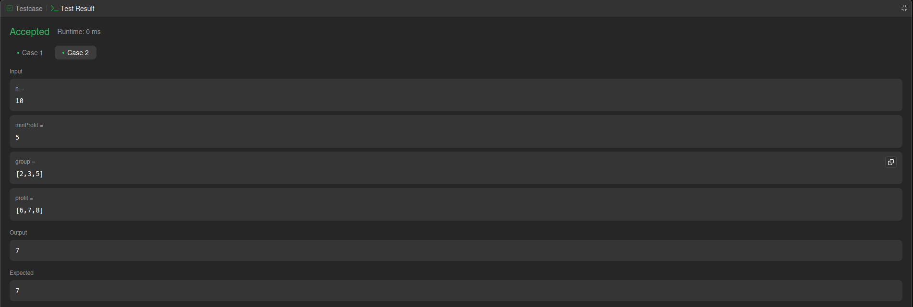

# PD_LeetCode-and-Hacker-Rank

**Conteúdo da Disciplina**: Programação Dinâmica

## Sobre

Este projeto consiste na resolução de questões da plataforma HackerRank e LeetCode, variando nas dificuldades de médio e difícil. O objetivo é utilizar o conteúdo estudado na disciplina de PA.

## Questões

</head>
<body>

<table>
    <thead>
        <tr>
            <th>Questão</th>
            <th>Nível</th>
        </tr>
    </thead>
    <tbody>
        <tr>
            <td><a href="https://leetcode.com/problems/maximum-profit-in-job-scheduling/description/" target="_blank">1235. Maximum Profit in Job Scheduling</td>
            <td>Difícil 01</td>
        </tr>
        <tr>
            <td><a href="https://leetcode.com/problems/profitable-schemes/description/" target="_blank">879. Profitable Schemes</td>
            <td>Difícil 02</td>
        </tr>
    </tbody>
</table>

</body>
</html>

## Contribuidores

</head>
<body>

<table>
    <thead>
        <tr>
            <th>Matrícula</th>
            <th>Nome</th>
            <th>GitHub</th>
        </tr>
    </thead>
    <tbody>
        <tr>
            <td>202046102</td>
            <td>Felipe das Neves Freire</td>
            <td><a href="https://github.com/FelipeFreire-gf" target="_blank">Felipe</a></td>
        </tr>
        <tr>
            <td>222037700</td>
            <td>Leonardo de Melo Lima</td>
            <td><a href="https://github.com/leozinlima" target="_blank">Leonardo</a></td>
        </tr>
    </tbody>
</table>

</body>
</html>

## Linguagem Utilizada

- Python

## Uso

Entrar na plataforma [HackerRank](https://www.hackerrank.com/dashboard), procurar pelo nome/número do exercício, colar na aba code e clicar em _Run Code_

Entrar na plataforma [LeetCode](https://leetcode.com/problem-list/divide-and-conquer/), procurar pelo nome/número do exercício, colar na aba code e clicar em _Submit_

## Screenshots do HackerRank & LeetCode

  
<b>Figura 1: Resultados questão difícil LeetCode 1235</b>

  
<b>Figura 2: Resultados questão difícil LeetCode 1235</b>

  
<b>Figura 3: Resultados questão difícil LeetCode 1235</b>

  
<b>Figura 4: Resultados questão média LeetCode 879</b>

  
<b>Figura 5: Resultados questão média LeetCode 879</b>

## Vídeo

Explicamos todos os códigos que fizemos na plataforma HackerRank e LeetCode:

</head>
<body>

<table>
    <thead>
        <tr>
            <th>Vídeo 01</th>
        </tr>
    </thead>
    <tbody>
        <tr>
            <td><a href="https://youtu.be/8p3u4R3VmEY" target="_blank">HackerRank and LeetCode Problem</a></td>
        </tr>
    </tbody>
</table>

</body>
</html>
